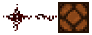

<div align="center">
  <picture>
    
  </picture>
</div>
<div align="center">
  <h3>Redstone mechanics in PocketMine-MP</h3>
</div>
<div align="center">
 <a href="https://github.com/Cosmoverse/Redstone/blob/master/LICENSE"></a>
 <a href=""></a>
 <a href="https://join.cosmicpe.me/cannon"></a>
</div>

---

This is a PocketMine-MP plugin that implements several Redstone mechanics. At present the priority is cannoning, so clocks, pistons, dispensers, and repeaters.
Goal is Java 1.8 parity as that is what factions servers with cannoning usually run on. A player who raids boxes is more likely to know this setup than whatever the Bedrock devs at Mojang are presently cooking.

A creative-mode server runs on [cannon.cosmicpe.me](https://join.cosmicpe.me/cannon). You get a private 640 by 640 plot that persists - use it to test the plugin.

## Installation
Pre-compiled phar files are available in [releases page](https://github.com/Cosmoverse/Redstone/releases).
Drag and drop them in `plugins/` folder and restart your server.
Ensure your server is using PHP 8.4+ binaries.

## Contributing
Do not mistake the 1.8 parity for a hard constraint. Feel free to contribute other mechanics or even later-Java behaviour.
This plugin has no external dependency - clone this repo directly to your `plugins/` folder and install [DevTools](https://github.com/pmmp/DevTools/).
```sh
.
├── PocketMine-MP.phar
├── start.sh
└── plugins/
    ├── DevTools.phar
    └── Redstone/
        ├── plugin.yml
        └── src/
```
